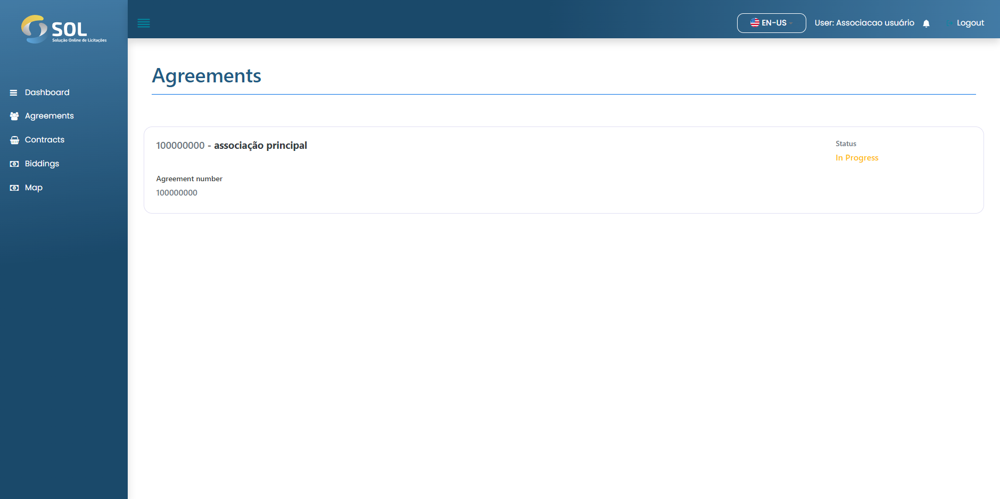
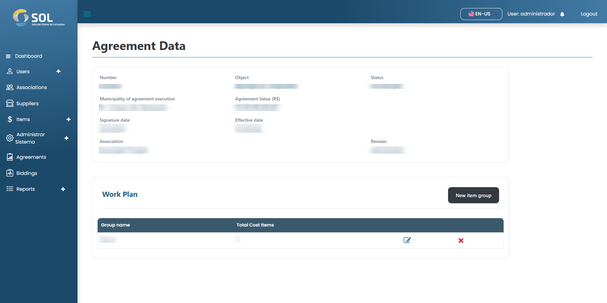

# Agreements

In the "Agreements" tab, accessible through the main menu at the top of the page, you can see a list of all agreements registered in the system, view details about them, edit information, delete an agreement, or add a new one.


It's worth noting that if the agreement data has been imported from an integration, it is not possible to edit them, regardless of the administrator's profile.


<figure><figcaption></figcaption></figure>

### How to view agreement details?

<figure><figcaption></figcaption></figure>

By clicking on the name of a agreement, you have access to the page with general information.


The "Work Plan" is where the items purchased in that Agreement must be specified. To access the page with these items, just click on the work plan link.

