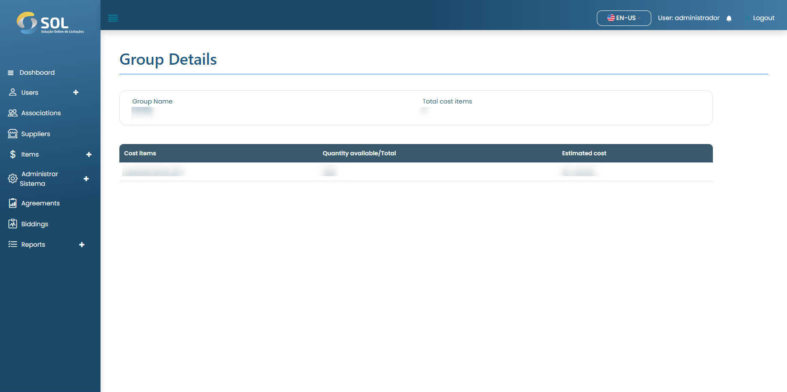

# Item groups

When you click on the name of a agreement, you have access to the page with general information.


The "Work Plan" is where the items purchased in that Agreement must be specified. To access the page with these items, just click on the work plan link.


<figure><figcaption></figcaption></figure>

### How to view group details?

If you click on one of the listed groups, the System opens a screen with the data of that group.

<figure><figcaption></figcaption></figure>
