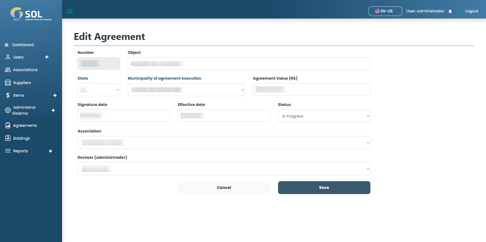

# Update agreement

### How to update a registered agreement?

To edit information for a registered agreement, simply click on the plus icon available next to the agreement name in the list on the "Agreements" tab, and click in Edit agreement.

<figure><figcaption></figcaption></figure>

Then, make the necessary changes and click on "Save". The changes will be saved and the agreement will be updated.
