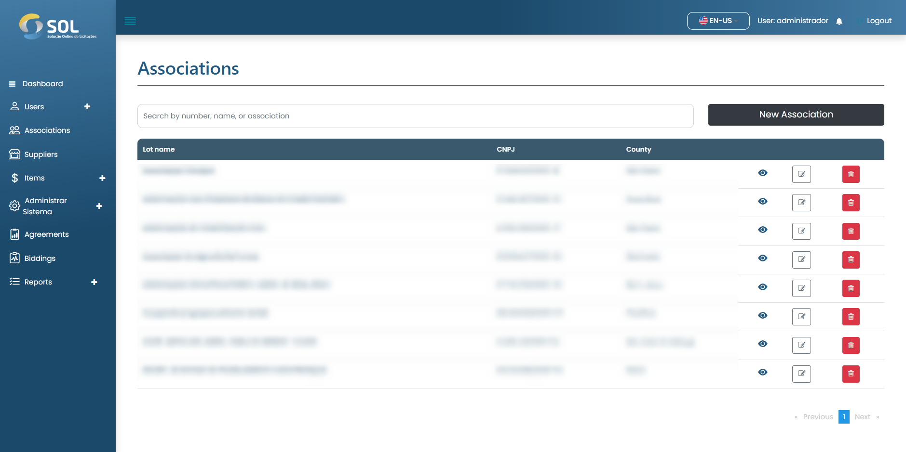

# Association

In the "Associations" tab, accessible through the main menu at the top of the page, you can see a list with all Associations registered in the System, view details about them, edit their information, delete an Association, or add a new Association.

<figure><figcaption></figcaption></figure>


It is worth noting that if the Association data has been imported from an integration, it is not possible to edit them, regardless of the Administrator's profile.


### How to view association details?

When you click on the name of an Association, you will access the page with its general information, including which agreements it is currently linked to and who is the Reviewer responsible for its bids and contracts.

<figure><figcaption></figcaption></figure>
