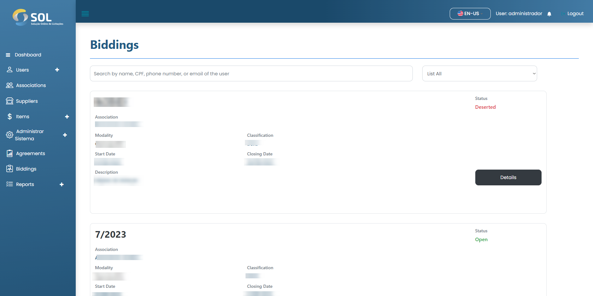
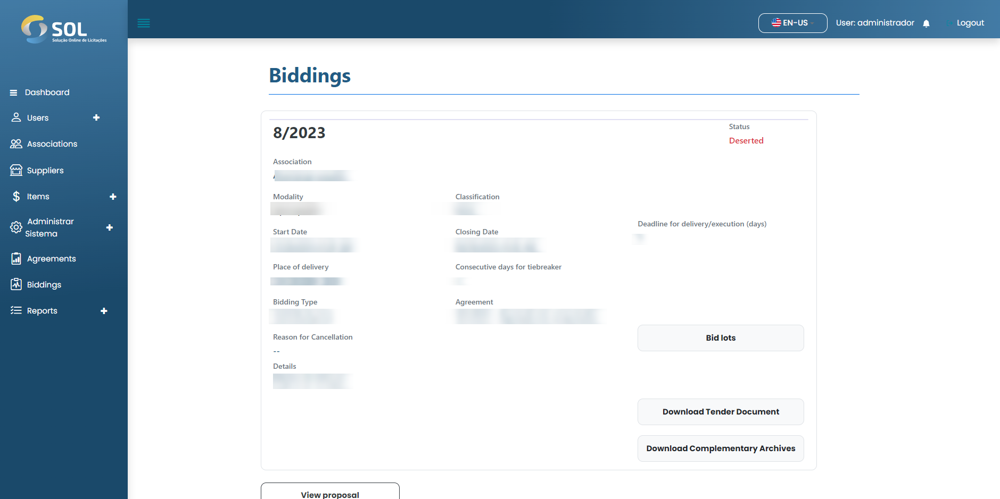

# Biddings

On the "**Biddings**" tab, accessible through the main menu at the top of the page, you can see a list with all **Biddings** registered in the system, even the ones that have already concluded.

<figure><figcaption></figcaption></figure>

### How to view a bidding details?

To access complete information about a bidding, simply click on the Detail button available in the bidding's panel.


The Administrator has permission to perform actions such as releasing the bidding and approving or rejecting the choice between proposals made by the Association. As a rule, the Administrator does not perform any of these actions, as they are functions of the Reviewer that he designates for each agreement. Therefore, throughout all items related to biddings, this manual will refer to the Reviewer profile.


<figure><figcaption></figcaption></figure>
