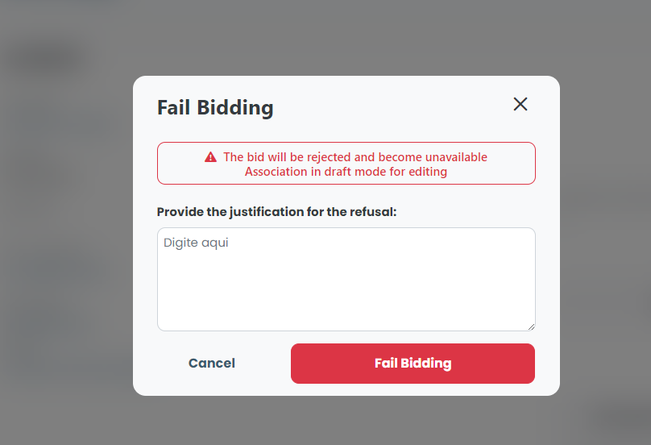

# Release/Reject bidding

### How to Release or Reject a Bidding?

When accessing the details of a bidding whose status is "Awaiting release", you can click on Release bidding or Reject bidding.

<figure><figcaption></figcaption></figure>

If you have chosen to reject the bid, you must fill out and describe the reason for the rejection.

<figure><figcaption></figcaption></figure>

After filling out the justification, simply click on Fail bid.
