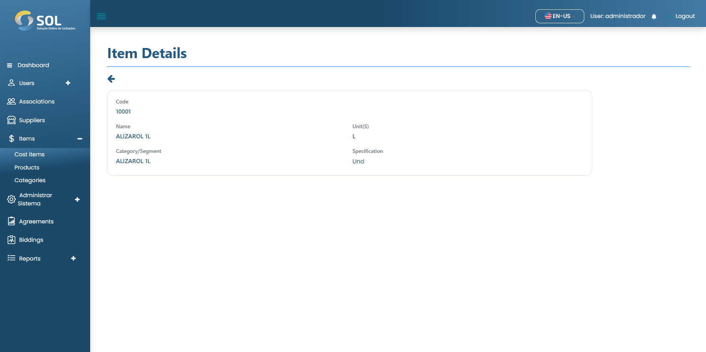

# Cost items

In the "Cost Items" tab, accessible through the main menu at the top of the page, you can see a list with all the cost items registered in the system, view details about them, edit the information, delete an item, or add a new item.


It is worth noting that if the cost item data has been imported from an integration, it is not possible to edit them, regardless of your administrator profile.


<figure><figcaption></figcaption></figure>

### How to view item details?

By clicking on one of the items, you have access to the page with the general data, including which segment and category it belongs to.

<figure><figcaption></figcaption></figure>
