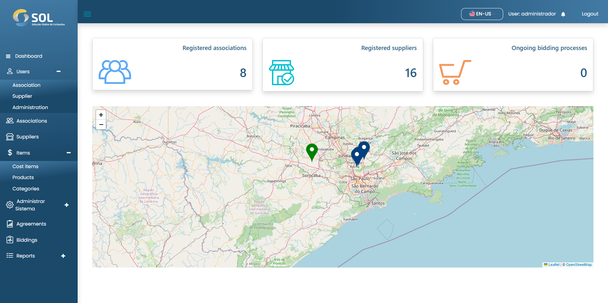

# Dashboard

<figure><figcaption></figcaption></figure>


When accessing the SOL platform, you are directed to the initial panel of the System (Dashboard).


On this screen, you will see the available tabs in the main menu:

* **Dashboard**
* **Users**
  * Association
  * Suppliers
  * Administration
* **Associations**
* **Suppliers**
* **Cost Items**
* **Agreements**
* **Integrations** (Under development)
* **Bids**
* **Reports** (Under development)
  * Bids
  * Contracts
  * General Reports
  * Generated Reports

Additionally, you have access to your profile and System notifications - represented by the person and bell icons, respectively - as well as the map, which shows suppliers with green dots and associations with blue dots. Above the map, there are three areas that display the number of associations and suppliers registered on the platform and the number of ongoing bids.

On the map, you can click on the registered suppliers and associations. Clicking on a Supplier's dot will redirect you to a new screen with their respective information.
