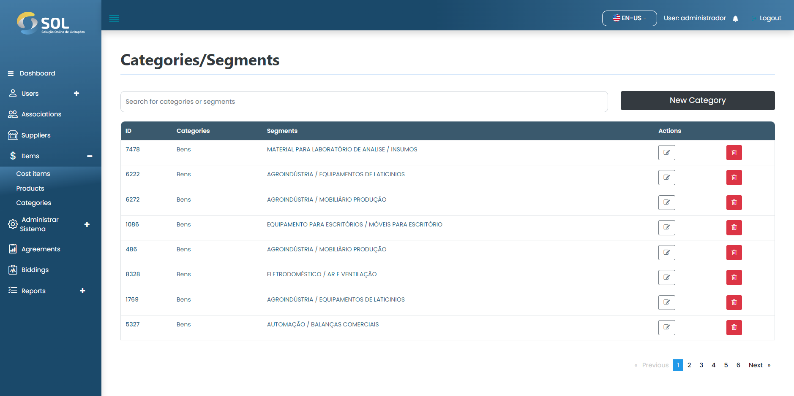

# Categories/Segments

In the "Categories/Segments" tab, accessible through the main menu at the top of the page, you can see a list with all the Categories/Segments registered in the system, edit the information, delete, or add a new Categories/Segmens.

<figure><figcaption></figcaption></figure>
