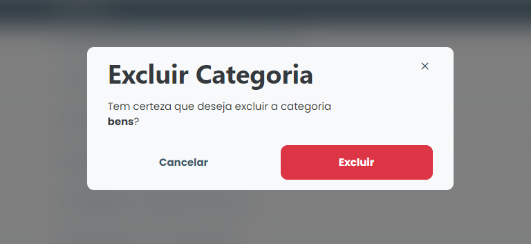

# Delete Categories/Segments

### How to delete Categories/Segments

To delete a registered Categories/Segments, simply click on the delete icon (trash can) available next to the name of the Categories/Segments in the list in the "Categories" tab.

<figure><figcaption></figcaption></figure>

Then, the system will display a confirmation modal, simply click on "Delete" and that Categories/Segments will be removed from the system.
