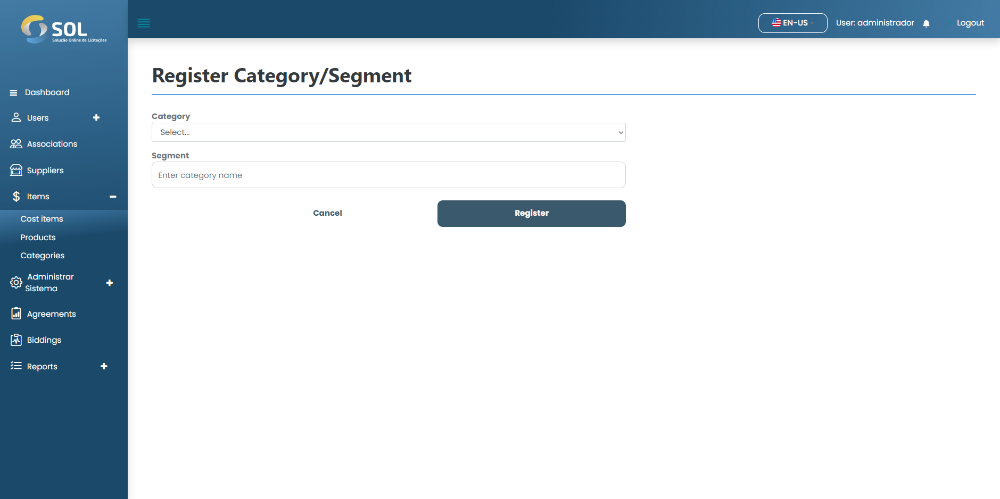

# New Categories/Segments

### How to add a new Categories/Segments?

To add a new Categories/Segments to the system, simply click on the "New Category" button. Then, fill in the requested fields.

<figure><figcaption></figcaption></figure>

After filling in all the fields, simply click on "Register".
