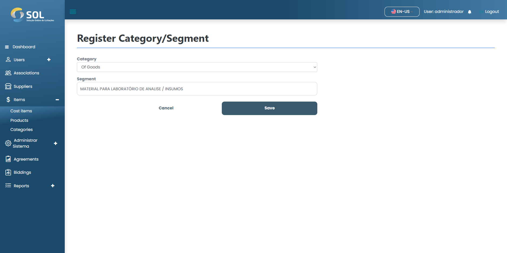

# Update Categories/Segments

### How to update a registered Categories/Segments?

To edit information for a registered Categories/Segments, simply click on the edit icon (pencil) available next to the name of the Categories/Segments in the list in the "Categories" tab.

<figure><figcaption></figcaption></figure>

Then, make the necessary changes and click on "Save". The changes will be saved and the Categories/Segments will be updated.
