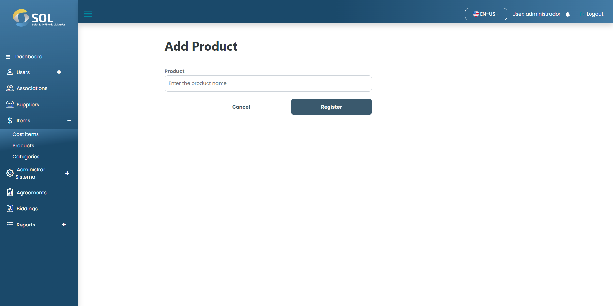

# New Product

### How to add a new product?

To add a new product to the system, simply click on the "New product" button. Then, fill in the requested fields.

<figure><figcaption></figcaption></figure>

After filling in all the fields, simply click on "Register".
