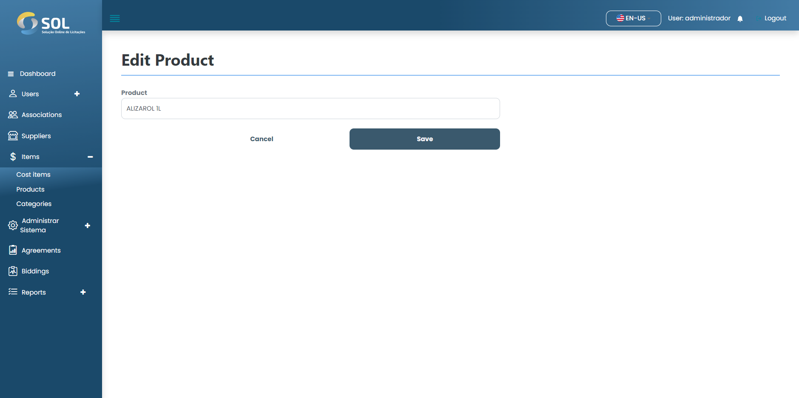

# Update Product

### How to update a registered product?

To edit information for a registered product, simply click on the edit icon (pencil) available next to the name of the product in the list in the "Products" tab.

<figure><figcaption></figcaption></figure>

Then, make the necessary changes and click on "Save". The changes will be saved and the product will be updated.
