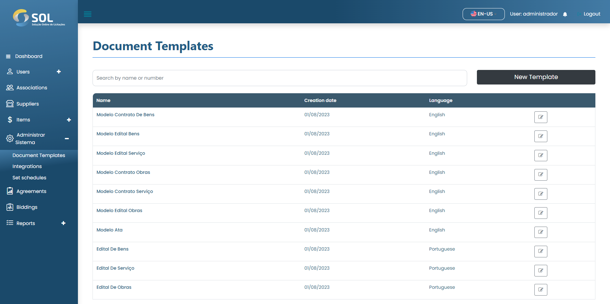

# Document templates

On the "Template" tab, accessible through the main menu at the top of the page, you can see a list with all document templates registered in the System, edit their information.

<figure><figcaption></figcaption></figure>
