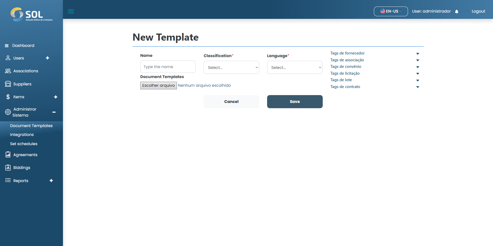

# New templates

### How to add a new template?

To add a template to the System, simply click on the "New Template" button. Then, fill in the required fields.

<figure><figcaption></figcaption></figure>

After filling out all the fields, simply click on Save.
