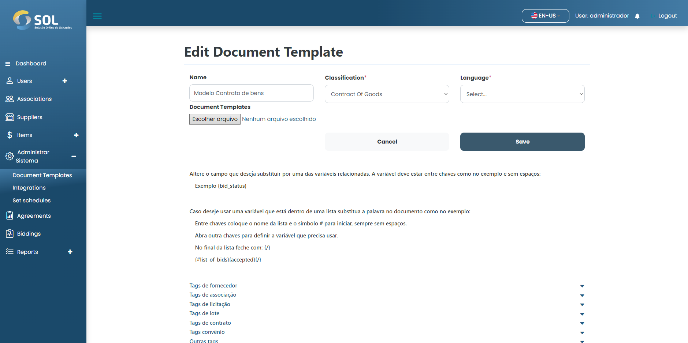

# Update templates

### How to update a registered item?

To edit information for a registered template, simply click on the edit icon (pencil) available next to the name of the templates in the list in the "templates" tab.

<figure><figcaption></figcaption></figure>

Then, make the necessary changes and click on "Save". The changes will be saved and the template will be updated.
