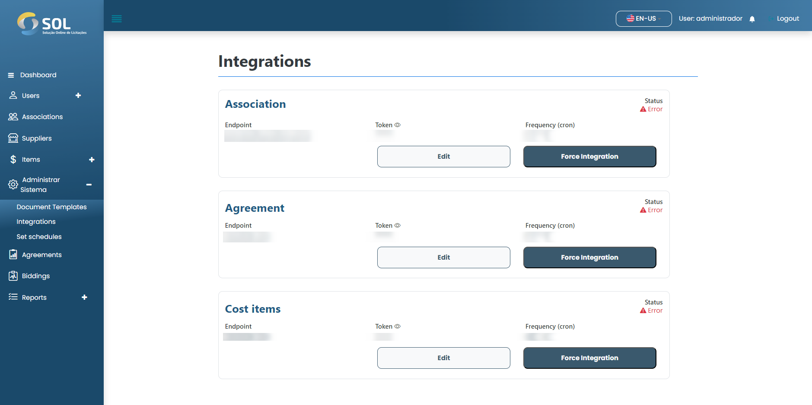

# Integration

On the "Integration" tab, accessible through the main menu at the top of the page, you can see a list with all Integrations in the System, edit their information and force the integration.

<figure><figcaption></figcaption></figure>
