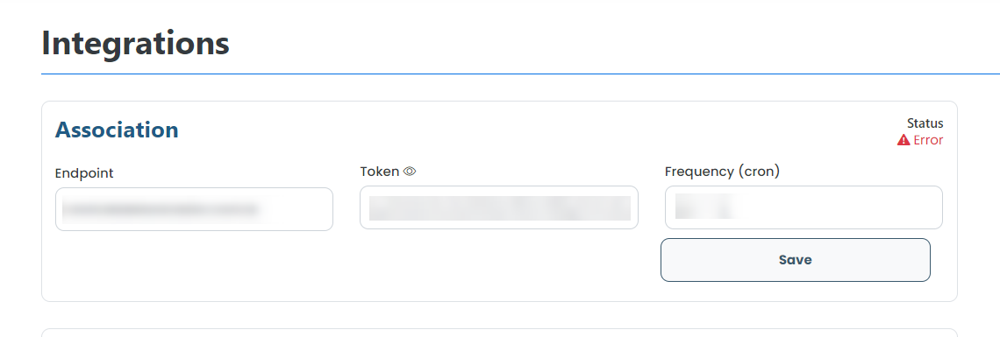

# Edit integration

### How to edit a integration?

To edit a integration, simply click on the edit available next to the name of the integration in the list in the "Integrations" tab.

<figure><figcaption></figcaption></figure>

Then, make the necessary changes and click on "Save". The changes will be saved and the integration will be updated.
