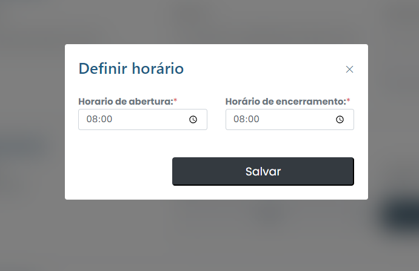

# Set schedule

### How to set a schedule?

To set a schedule, simply click on Set schedules tab on menu.

<figure><figcaption></figcaption></figure>

Then, set the necessary information and click on "Save". The changes will be saved and the schedule will be confirmed.
