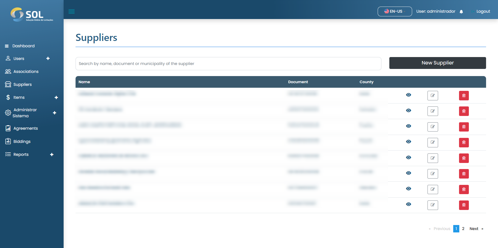

# Supplier

On the "Suppliers" tab, accessible through the main menu at the top of the page, you can see a list with all Suppliers registered in the System, view details about them, edit their information, delete a Supplier, or add a new one.

<figure><figcaption></figcaption></figure>

### How to view supplier details?

When you click on the name of a Supplier, you will access a page with their general information, including which categories they can supply products to.

