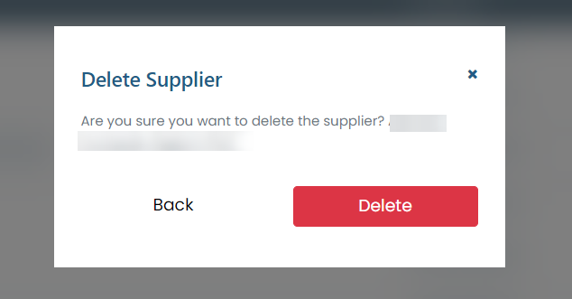

# Delete supplier

### How to delete the supplier?

To delete a registered supplier, simply click on the delete icon (trash can) available next to the supplier's name in the list available in the "Suppliers" tab.

<figure><figcaption></figcaption></figure>

Then, the system will display a confirmation modal, simply click on Delete and that supplier will be removed from the system.
