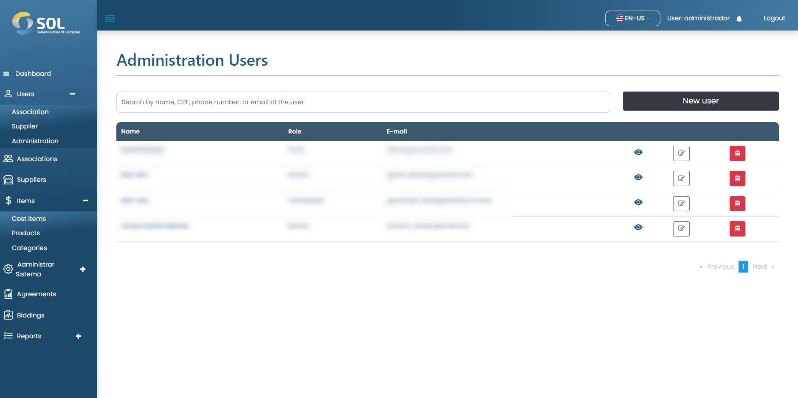

# Administrative users

To access the list of administrator users, click on the Users option in the sidebar menu and select Administration.&#x20;

The list displays information such as name, email, document number and Association. It is possible to search for text using the information provided in the list.

<figure><figcaption></figcaption></figure>
