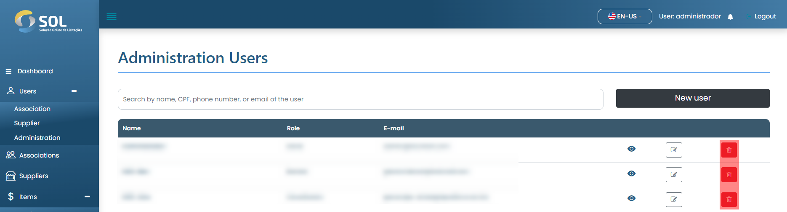

# Delete user

### How to delete a user?

To delete a registered user, simply click on the delete icon (trash can) available next to the profile name in the list available in the "Users" tab.

<figure><figcaption></figcaption></figure>

Then, the system will display a confirmation modal, just click on "Delete" and that user will be removed from the system.

<figure><figcaption></figcaption></figure>
