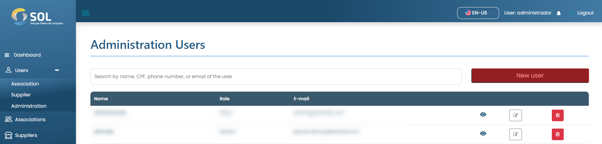
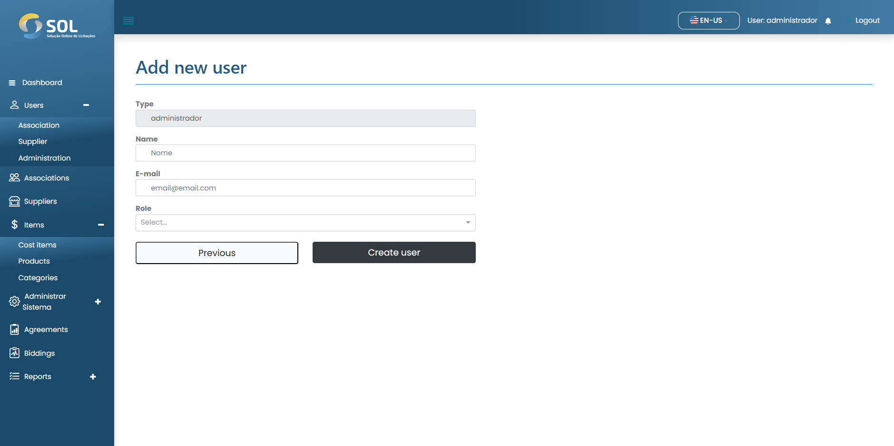

# Register user

### How to register a new user?

To add an Administration user, simply click on the "New User" button and fill in the fields on the page that will open next.

<figure><figcaption></figcaption></figure>


In the "Role (type)" field, you need to select the type of profile that the user will have, which impacts the permissions that the user will have within the system.


<figure><figcaption></figcaption></figure>

After filling in all the fields, simply click on "Create User".
