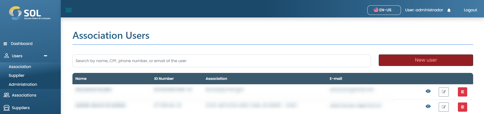
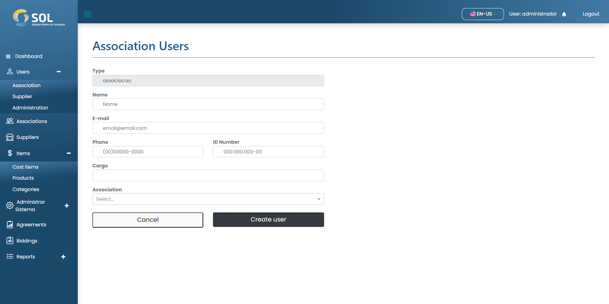

# Register user

### How to register a new user?

To add an Association user, simply click on the "New User" button and fill in the fields on the page that will open next.

<figure><figcaption></figcaption></figure>


In the "Association" field, you must enter at least the first three letters of the name of an Association. This will cause the System to display a list of all associations that contain those letters. The same process should be repeated to fill in the "Position" field.


<figure><figcaption></figcaption></figure>

After filling in all the fields, simply click on "Create User".
