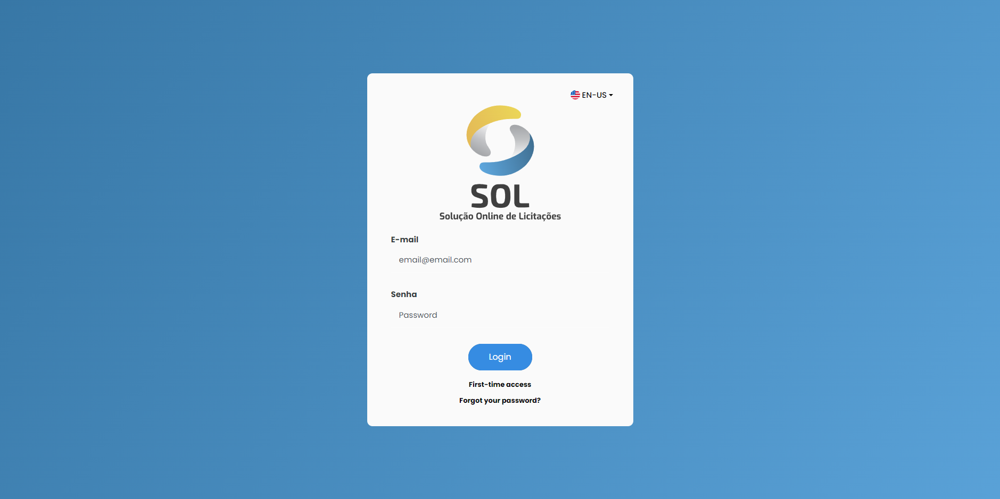
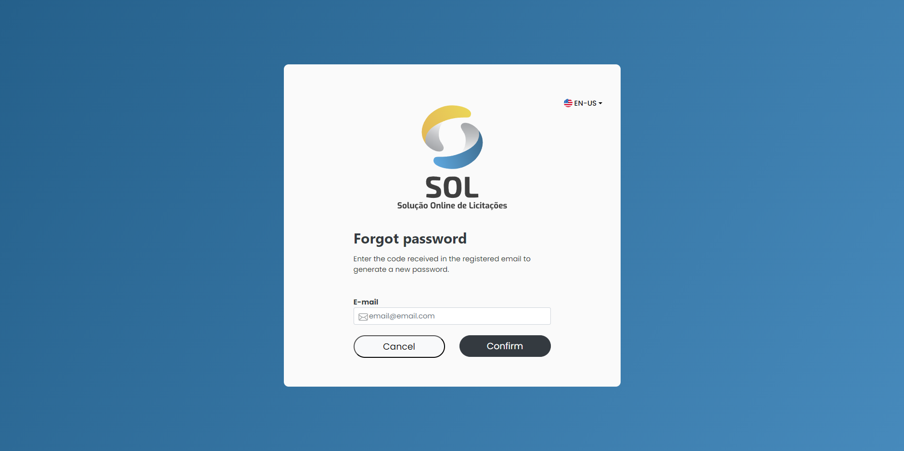

# Access control

## Join the platform

The registered user accesses the platform with the e-mail and password. Only the administrator can register new users.


Link:



<figure><figcaption></figcaption></figure>

## Forgot the password

To recover access, click on "Forgot Password?" on the Login screen.

Enter the registered email and click on "Continue".

<figure><figcaption></figcaption></figure>

You will receive a code to validate your email. Enter the code and click on "Continue".

Once the code is validated, create a new password and confirm it. Then click on "Continue".

That's it! Now you can log in with your new password.
