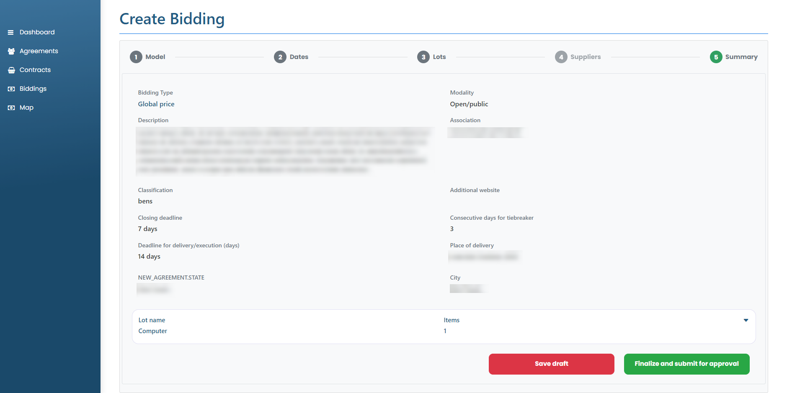

# New bidding

### How to create a new bidding?

To create a new bid, simply click on the Create bid button. You will be directed to the "New Bid" screen, in which you must fill in all the requested information in all the steps.


Bidding classification:

* Goods: are those bids aimed at purchasing materials such as, for example, office items (printers, computers, pens and paper);
* Works: are those aimed at the purchase of materials to carry out a construction, such as: bricks, cement or sand;
* Service: those aimed at contracting services such as, for example, vehicle registration or bricklayer labor.



Type of bidding:

* Individual price: each lot can have only one item. In this type, suppliers will be able to send specific proposals for each item, without the obligation to send proposals for everyone. At the end of the bidding process, the Association may accept proposals from different suppliers for each item;
* Price per Lot: Each lot can have multiple items. In this type of bidding, suppliers are obliged to send proposals by batch, covering all items listed within it. Likewise, the Association will accept proposals by lot. If the bid has two or more lots, it can choose different suppliers among the lots, according to the best proposal value;
* Global price: the Supplier will be obliged to send a proposal that includes all the lots and all the items listed in the bid, and a single Supplier must supply all the products, goods or services bid.



Type of bidding:

* Open/public: the tender is public and can be viewed by all suppliers, who can submit proposals. All registered Suppliers that are compatible with the classification and bidding segment will receive a notification informing the opening. In addition, the Association may send invitations to registered Suppliers;
* Open Invitation: The bid can be viewed by all suppliers. Any Supplier can participate in the bidding, but the Association sends direct invitations to specific suppliers chosen by it, who receive a notification with the invitation. If any supplier requests participation, the request will be automatically accepted by the system;
* Closed invitation: only invited suppliers can view or participate in the bidding. The Association manages the invitation only to the suppliers that it wants to participate in the tender created. If the invited Supplier chooses to participate in the bidding, he must send a proposal that cannot be edited later.


<figure><figcaption></figcaption></figure>

<figure><figcaption></figcaption></figure>

<figure><figcaption></figcaption></figure>

<figure><figcaption></figcaption></figure>

Then, just click on Create bid and your bid will be created as “Draft”.&#x20;

While the bidding status is in "Draft", it is possible to click on the "Edit" button to change all the fields, except "Type of bidding" and "Modality", which cannot be modified. Also, while it is under the status "In draft", the bid can still be deleted by clicking on the "Delete" button.
