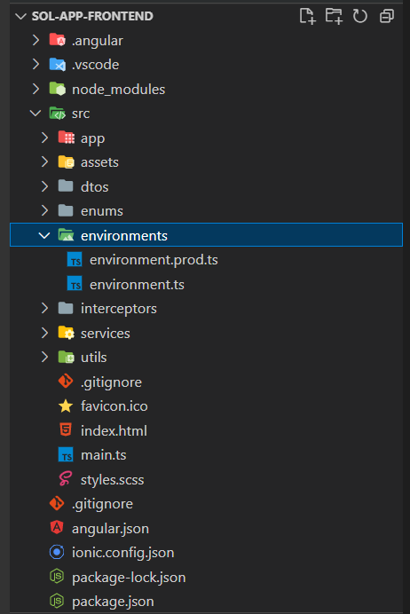

# Frontend installation

## Preparing the environment&#x20;

It is necessary to install some tools. Click on the links below to incite each one of them.

[](https://yarnpkg.com/cli/install)[](https://nodejs.org/en/)

## Configuring the environment file (.env)&#x20;

In the `src/enviroments/` directory it is necessary to change the `environment.prod.ts` file.

<figure><figcaption></figcaption></figure>

Change parameters:

```
encrypt_key: a mesma utiliazada na API
api server e port
```

## Publishing the frontend with Nginx&#x20;

Access the root directory of the API and run the command below:

<pre><code><strong>λ ng build --c production
</strong></code></pre>

#### Configure nginx&#x20;

You can verify that nginx is up and running with:

```
sudo systemctl restart nginx
sudo systemctl status nginx
```

#### NGINX CONFIGURATION&#x20;

The setup in the previous section is as simple as it gets. It will listen on HTTP port 80 for any hostname that has not already been intercepted. Ideally, specify a `server_name`, add SSL, redirect HTTP to HTTPS. You might also consider redirecting non-www to www, adding caching, or including rate limiting. Nginx can do all these things.

```
# /etc/nginx/conf.d/mysife.conf

server {
  listen 0.0.0.0:80;
  root /srv/mysite;
  location / {
    try_files $uri $uri/ /index.html;
  }
}
```
