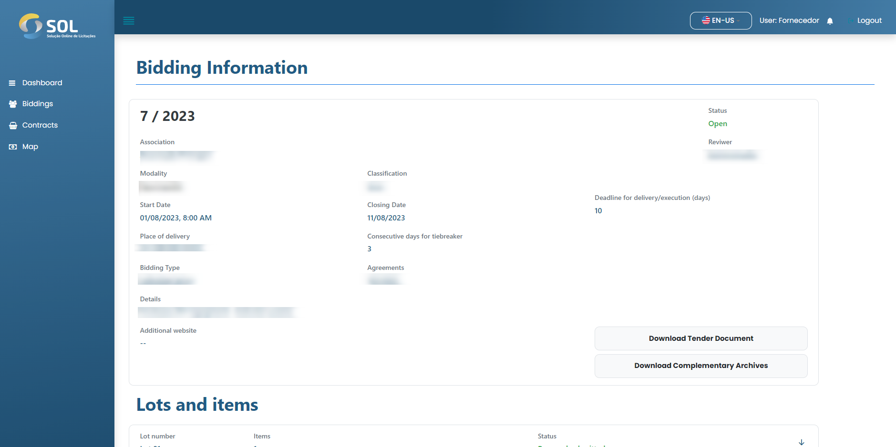

# Bids

In the "Bids" tab, which can be accessed through the main menu or by clicking on the System's home page, you will be directed to a list of all biddings you are participating in, including those that have already been completed.

<figure><figcaption></figcaption></figure>

### Bid types


### Open/public

The bidding is public and any supplier can submit proposals. Once opened, it is available on the Supplier's home page and also on the "Bid" page.



### Open invite

As in the previous case, any Supplier can participate in the bidding, but the Association sends direct invitations to the specific suppliers chosen by it, who receive an automatic notification. By accepting the invitation, the Supplier will automatically participate in the bidding process.



### Closed invite

"Closed invitation" tenders are only visible to Suppliers invited by the responsible Association. There is no other way to gain access to these bids other than through the Association's invitation.&#x20;

The only differences between proposals sent for "Closed invitation" modality and other modalities is that, in this case, the proposal cannot be changed after submission and, if it is removed, the Supplier will not be able to send a new proposal.


### How to view the details of a bid?

To access complete information about a bid, just click on a bid on the System's home page or in the bid area.

<figure><figcaption></figcaption></figure>
