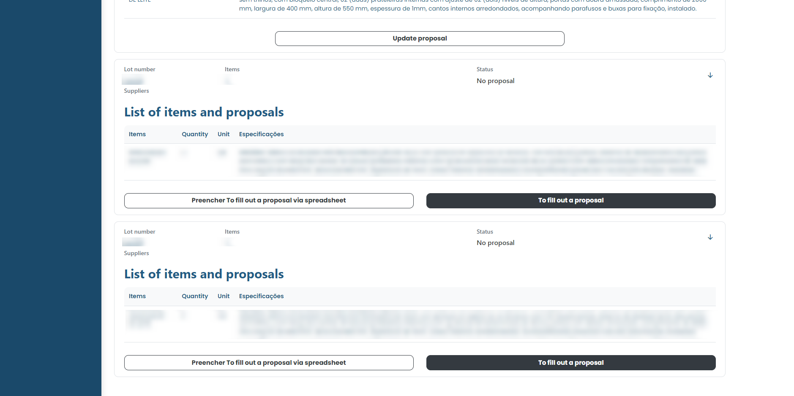
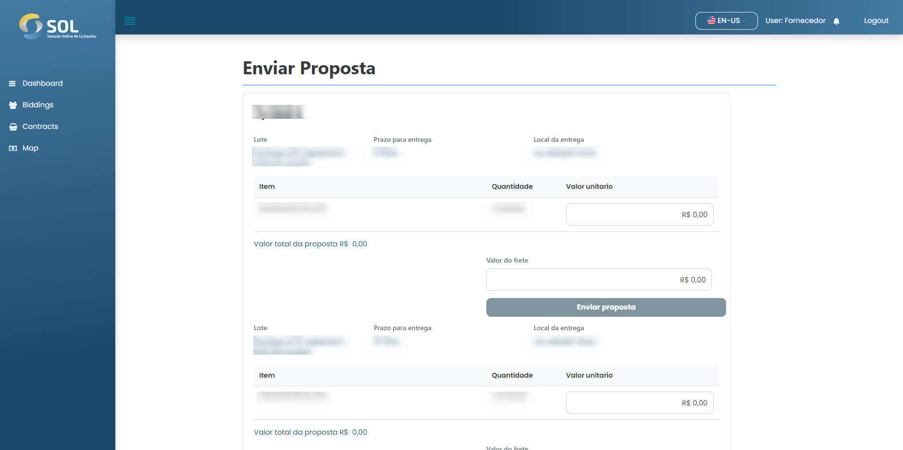
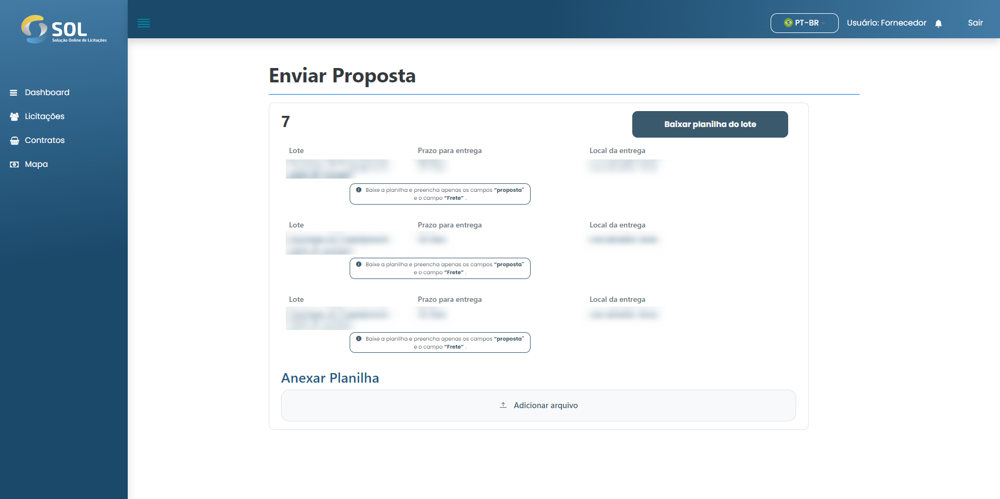

# Submit proposal

### How to submit a proposal?

On the "Lots and Items" page, accessed through the side menu. When you click on the lot, the details are expanded, showing all the items registered in it. If the bidding is of the “Price per item” type, the only button available on this new screen will be the Fill proposal.&#x20;

If it is of the type “Price per lot” or “Global price”, the Fill proposal via spreadsheet button will also be displayed and you must choose one of the filling methods.

<figure><figcaption></figcaption></figure>

### Complete Proposal Through the System

If you choose to complete your proposal directly in the System, just click on Fill proposal. Then the system will open the "Send proposal" page, just click on Click to enter a proposal. Once this is done, an area for filling in the proposal opens, where you must inform the value per unit of the item. Then, just fill in the "Shipping value" field. If there is no freight charge, it is necessary to fill in the field with the number zero (0).

<figure><figcaption></figcaption></figure>

With the proposal filled out, just click on Submit proposal. With that done, just wait for the deadline for closing the bidding. You will receive a notification when the Association is reviewing the proposals received.

### Complete Proposal Via Spreadsheet

In cases of “Price per lot” or “Global price” bidding, you will have the option to fill in the proposal using a spreadsheet. To do this, just click on the Fill proposal via spreadsheet button.

Upon doing so, the “Complete Proposal” screen appears. In it, you must click on the “Download batch spreadsheet” button.


By doing so, the download of a file in XLSX format, which can be opened with Excel, LibreOffice or Numbers software, starts. Open this file to start filling out the proposal. The downloaded spreadsheet has two tabs, one called "item value proposal" and another called "freight value proposal". You must fill in the cells of the "proposal" column on the first tab and the "shipping (value)" column on the second. Then just save the change and close the file.


Then, go back to the System and click on the button with the figure of clips, in the right corner of the “Spreadsheet” field, to attach the file you just filled out.

<figure><figcaption></figcaption></figure>

With that done, just click Submit Proposal. In a short time, the System will send you a notification informing you if the processing of the worksheet was successful.
