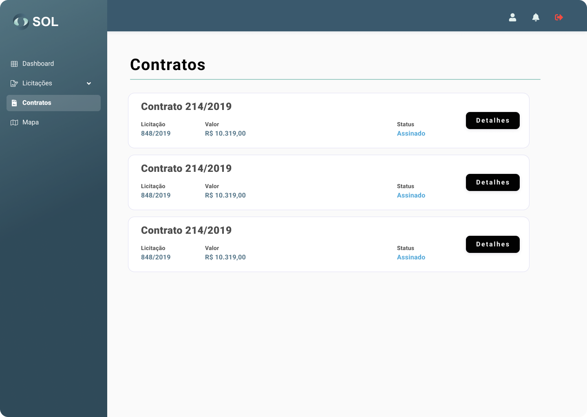

# Contracts

If you are the winning supplier of the bidding, the System will generate a contract with the information of the items, quantities and terms that were already included in the bidding. This contract will be available on the "Contracts" page, which can be accessed through the main menu of the System.

<figure><figcaption></figcaption></figure>

### How to view the details of a contract?

To check the contract details or sign it, click on it.

<figure><figcaption></figcaption></figure>


Clicking on Proposal will open a page that works as a link to the bid that gave rise to the contract and to the proposal sent by the Supplier.

