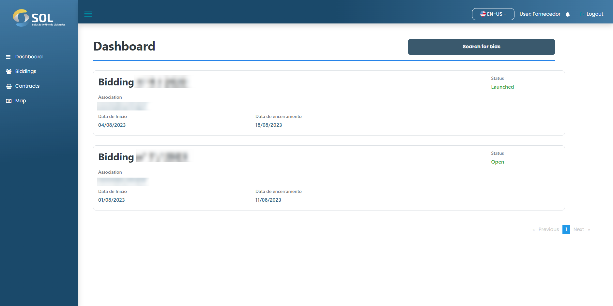

# Dashboard


When accessing the SOL platform, you are directed to the initial panel of the System (Dashboard).


<figure><figcaption></figcaption></figure>

On this home screen, you will see an overview of your profile: your personal information and the latest open bids - those that you are participating in or that you can participate in.


For each displayed bid, we have access to the latest ten open bids and can view the key information about the documents. These are:

* The title of the bid;
* Its current status;
* The period of time it will remain open.

To view all bids, in addition to the latest ones, simply click on the Browse bids button.


Additionally, you have access to your profile and System notifications - represented by the person and bell icons, respectively.
